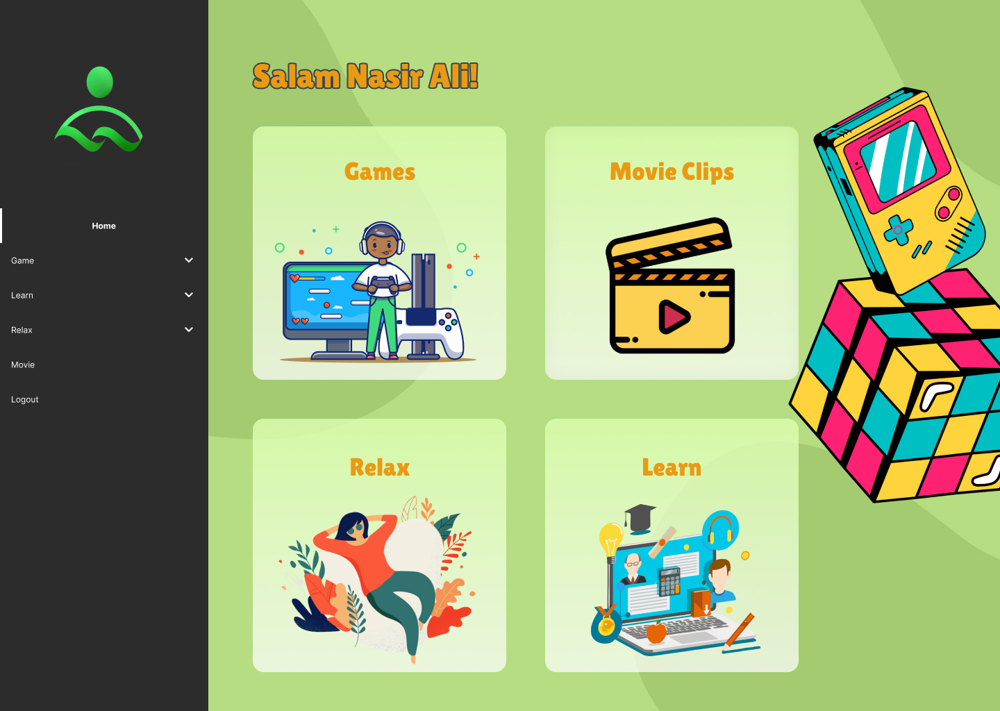
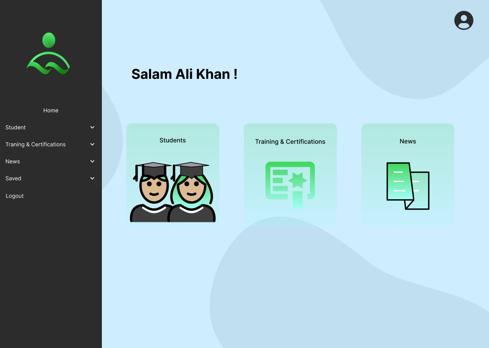

# Khayr

A simple web app for landing page of Khayr App

Link to Figma: [Link](https://www.figma.com/design/VV3ddVkxAa7xZVYCXIVBrc/Khayr?node-id=267-2966&t=XcyuL66Y6TyJ4Xj7-0)

This project is built to help children that have troubled background or are victims of abuse , harassment etc

This app has two users:

1. Studnet
2. Teacher

## Student

A student can :

1. Play games
2. Watch movie clips
3. Do breating exercises to relax
4. Learn new stuff such as painting etc

## Teacher

The teacher is responsible for helping these troubled kids, they can :

1. View the profile of students
2. Do related trainings to understand the behavior of students better.
3. Read news about the recent developments

